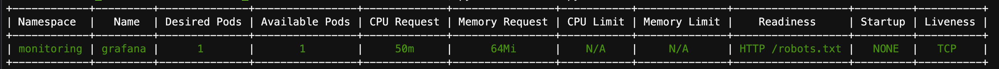

# Kubernetes Deployments Information

This script provides a color-coded table view of Kubernetes deployments, showing the namespace, name, desired pods, available pods, CPU request/limits, and memory request/limits and type of probes that each deployment has.



## Prerequisites

- Python >= 3.6

## Installation

1. Clone this repository:

```git clone https://github.com/pbullian/k8s_deployments_info.git```

2. Change to the `k8s_deployments_info` directory:

```cd k8s_deployments_info```

3. Install the required packages:

```pip install -r requirements.txt```


## Usage

Make sure you have `kubectl` configured to access your Kubernetes cluster.

Run the script:

```python k8s_deployments_info.py```


The output will display a color-coded table with green rows for deployments where the desired and available pods match, yellow rows for deployments with less available pods, and red rows for deployments with no available pods.
